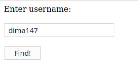
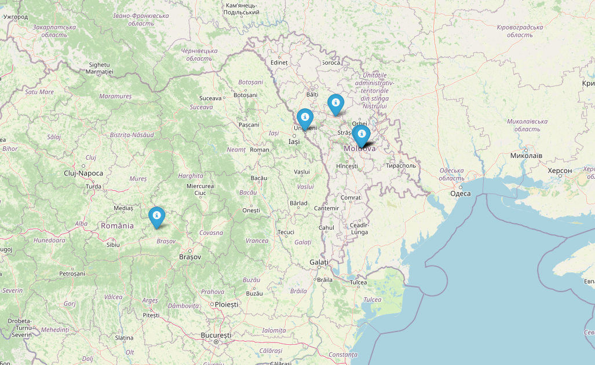

# JSON Navigator

Friends Locator is a Python module that creates map with user's friends.

## Description

The module creates map with markers of locations that specified user's friends have entered in their profiles.

## Usage

```bash
friends_locator.py
```




## Web App

Available as web app at the url: http://viktorpovazhuk.pythonanywhere.com